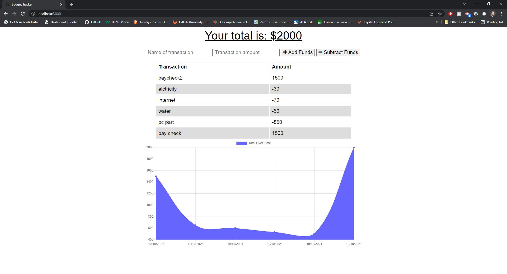

## Budget-Trackers

# Introduction

AS AN avid traveller
I WANT to be able to track my withdrawals and deposits with or without a data/internet connection
SO THAT my account balance is accurate when I am traveling

# Links

* link to my Repository:

https://github.com/TristanLibeau/Budget-Trackers

* Link on Heroku:

https://tristanlibeau-budgettrackers.herokuapp.com/

# Functionality:

GIVEN a user is on Budget App without an internet connection
* WHEN the user inputs a withdrawal or deposit
THEN that will be shown on the page, and added to their transaction history when their connection is back online.

# Mock-Up

* The following image shows the final application

## Credits

* StackOverflaw 
* BootCamp Course
* https://www.mongodb.com/developer/how-to/use-atlas-on-heroku/
